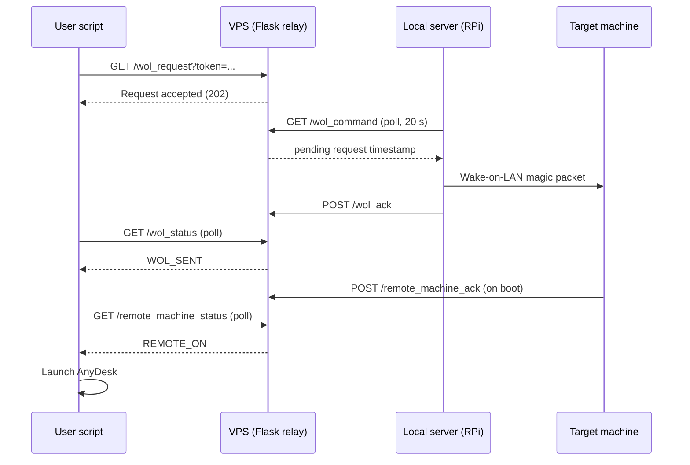

# vps-wake-on-lan-no-ssh

Remotely power on a machine behind NAT using a low-cost VPS as a relay and a small always-on device (e.g. Raspberry Pi) on the local network. No port forwarding, no SSH tunnels, no inbound connections to the home network.

<div align="center">

[](https://www.python.org)
[](https://flask.palletsprojects.com/)
[](https://www.raspberrypi.org/)
[](https://frog.mikr.us)


</div>

## Motivation

Most remote Wake-on-LAN setups require port forwarding or a VPN into the home network, which exposes the network to inbound traffic, botnet scanning, and brute-force attempts. This project takes a pull-based approach instead: the home network only ever makes outbound HTTPS requests, so its inbound attack surface stays closed. The public-facing component is a disposable, low-cost VPS that holds no secrets beyond a shared token and has no access to the home network.

## How it works

1. The user calls the `/wol_request` endpoint on the VPS over HTTPS, authorized by a token ([`user-machine/start_windows.sh`](user-machine/start_windows.sh) automates this).
2. The VPS records the request as a timestamped flag. A 10-second debounce window protects the endpoint from request flooding.
3. The local server polls the VPS `/wol_command` endpoint every 20 seconds ([`local-command-polling.py`](local-command-polling.py)). When a pending request is returned, it broadcasts a Wake-on-LAN magic packet to the target machine and confirms delivery back to the VPS via `/wol_ack`.
4. On boot, the target machine reports back to the VPS ([`remote-machine/notify.py`](remote-machine/notify.py)), closing the acknowledgement loop.
5. The user script tracks the whole sequence by polling `/wol_status` and `/remote_machine_status`, then launches a remote desktop client (AnyDesk) once the machine is up.

The full state flow is documented in [STATE_DIAGRAM.mmd](STATE_DIAGRAM.mmd).



## Components

| Component | Role | Key files |
|---|---|---|
| VPS relay | Public HTTPS endpoint; stores request/result state as flag files; serves a read-only status page with a request log | [`vps/`](vps/), [`vps-configuration.sh`](vps-configuration.sh) |
| Local server | Polls the VPS, sends the magic packet, acknowledges delivery; optional web dashboard for manual wake from inside the LAN | [`local-command-polling.py`](local-command-polling.py), [`local_server_dashboard/`](local_server_dashboard/), [`local-server-configuration.sh`](local-server-configuration.sh) |
| Target machine | Reports back to the VPS once booted | [`remote-machine/notify.py`](remote-machine/notify.py) |
| User machine | CLI script that triggers the wake and tracks progress end to end | [`user-machine/start_windows.sh`](user-machine/start_windows.sh) |

The VPS application is a Flask app (application-factory pattern with a blueprint) served by Gunicorn. Both long-running components on the local server are installed as systemd services, so they start on boot and restart on failure.

## VPS API

All endpoints require a token. Requests with an invalid token return `403 Forbidden`.

| Endpoint | Method | Caller | Purpose |
|---|---|---|---|
| `/` | GET | anyone | Read-only status page with recent log entries |
| `/wol_request` | GET | user | Request a wake-up (debounced, 10 s cooldown) |
| `/wol_command` | GET | local server | Poll for a pending request (consumed on read) |
| `/wol_ack` | POST | local server | Confirm the magic packet was sent |
| `/wol_status` | GET | user | Check whether the packet was sent (consumed on read) |
| `/remote_machine_ack` | POST | target machine | Report that the machine has booted |
| `/remote_machine_status` | GET | user | Check whether the machine is up (consumed on read) |

## Setup

Always use HTTPS for all communication with the VPS to prevent token leakage.

### Local server (Raspberry Pi)

Tested on a Raspberry Pi 4B with Raspberry Pi OS Lite 64-bit; other Debian-based machines may need minor adjustments. Have the MAC address of the target machine ready.

```bash
chmod +x local-server-configuration.sh
./local-server-configuration.sh
```

The interactive script installs dependencies (`wakeonlan`, Flask), validates and stores the target MAC address, generates or accepts authentication tokens (saved to `.wol_env`), and registers the polling agent and the optional dashboard as systemd services.

Point the polling agent at your VPS by editing the `VPS_URL` constants in [`local-command-polling.py`](local-command-polling.py), then restart the service:

```bash
sudo systemctl restart local-polling
```

The optional dashboard (port 80) shows the full log of sent packets and provides a one-click wake button for use inside the LAN. Restart it with `sudo systemctl restart local-dashboard`.

### VPS (Mikrus FROG, lowest tier)

1. Set up a [Mikrus FROG VPS](https://frog.mikr.us/) (runs Alpine Linux).
2. Clone this repository on the VPS and create a `.wol_env` file in the project root containing the `SERVER_TOKEN` generated during local server setup.
3. Run the configuration script:

```bash
chmod +x vps-configuration.sh
sudo ./vps-configuration.sh
```

The script installs Flask and Gunicorn and starts the application on your assigned port. Note that free-tier FROG instances are suspended if you do not log in every 3 months.

### Target machine

Enable Wake-on-LAN in the BIOS/UEFI and network adapter settings. To enable boot reporting, fill in `PORT` and `TOKEN` in [`remote-machine/notify.py`](remote-machine/notify.py) and schedule it to run at startup.

### User machine

Fill in `TOKEN` and `PORT` in [`user-machine/start_windows.sh`](user-machine/start_windows.sh) and run it. The script sends the wake request, reports each stage with elapsed time, and opens AnyDesk once the target machine confirms it is up.

## Security design

- Pull-based architecture: the home network makes outbound requests only, so no ports are exposed to the internet.
- Token-based authorization on every VPS endpoint, with tokens generated via `openssl rand -hex 32`.
- Request debouncing on the VPS to mitigate request flooding.
- Single-record, consume-on-read flag files keep the VPS stateless beyond the current request cycle.

## Roadmap

- Separate tokens for the local server and the caller (currently a single shared token).
- Move the token from the query string to an HTTP header.
- Authentication on the local dashboard to protect it from other devices on the LAN.
- Run the VPS Gunicorn process as a proper init/systemd-style service.
- Make the VPS host and port configurable in `local-command-polling.py`.

## Related project

[wake-on-lan-sms-pi](https://github.com/AlexSzczygielski/wake-on-lan-sms-pi) provides an out-of-band alternative trigger: waking the same machine via SMS through a GSM module on the Raspberry Pi, with caller-ID whitelisting. It works independently of the public internet and serves as a recovery channel when the VPS path is unavailable.
